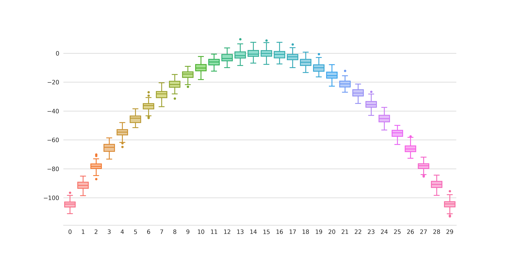

# plot-utils

Utility functions for creating special plots.

## GPS-Plot

Plot a map from one or more `.gpx` files using `gpxpy` and `tilemapbase`.

### Code

```python
from gps_plot import gps_plot, load_gps_data

paths = [
    "./gpx/activity_1.gpx",
    "./gpx/activity_2.gpx",
    "./gpx/activity_3.gpx"
]

coordinates = load_gps_data(paths)

gps_plot(coordinates, "./img/gps_plot.png")
```

### Example

<p align="center">
  
</p>

### Getting started

1. Install the dependencies with:

   ```
   python -m pip install -r requirements.txt
   ```

2. Put your .gpx files in in the `/src` folder

3. Run `python gps_plot.py` in the `/src` folder


## Rainbow Boxplot

Make a custom boxplot in rainbow color scheme.

### Example

<p align="center">
  
</p>
